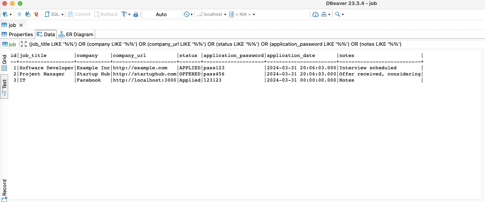

# Job Application Tracker

**Name**: Abdullah Saad  
**Course**: CIS*4900

## Acknowledgments
I would like to extend my deepest gratitude to Professor Judi McCuaig for her unwavering support and guidance throughout this project and CIS*3760. Her expertise and insights have been invaluable in navigating the complexities of this endeavor.

Additionally, I'm thankful to the students of Class CIS*3760 W24. Their enthusiasm and curiosity about Docker and CI/CD not only motivated me to delve deeper into these technologies but also enriched my learning experience in countless ways.

A special thanks goes to Niloy Ghosh, whose passion for Docker and CI/CD was contagious in CIS*3760 W23. Niloy's dedication and knowledge played a pivotal role in my journey, inspiring me to explore these tools further and ultimately fall in love with them.

I sincerely hope that this tutorial will serve as a helpful resource for future students. My aim is that it aids in their understanding of Docker and CI/CD, contributing to their success and advancements in the field. Here's to a future where more students harness the power of these essential technologies in their projects and professional endeavors.

## Table of Contents

1. [Description](#description)
2. [Project Learning Objectives](#project-learning-objectives)
3. [Learning Outcomes](#learning-outcomes)
4. [Technology Stack](#technology-stack)
5. [Features](#features)
6. [Project Architecture](#project-architecture)
   - [Overview](#overview)
   - [Architecture Diagram](#architecture-diagram)
7. [Docker Overview](#docker-overview)
   - [Docker Networking](#docker-networking)
   - [Docker Volumes](#docker-volumes)
   - [Proxy Configuration](#proxy-configuration)
8. [Services](#services)
   - [Spring Application](#spring-application)
   - [MySQL Database](#mysql-database)
   - [React Frontend](#react-frontend)
   - [Python Application](#python-application)
9. [Network Communication and Isolation](#network-communication-and-isolation)
10. [Internal Networks vs. Exposed Access Points](#internal-networks-vs-exposed-access-points)
11. [Volumes and Storage](#volumes-and-storage)
    - [mariadb_data](#mariadb_data)
    - [Host Directory Mounts](#host-directory-mounts)
12. [Ports](#ports)
13. [Application Demonstration Tutorial](#application-demonstration-tutorial)
    - [Prerequisites](#prerequisites)
    - [Steps](#steps)
        - [Step 1: Build and Run the Containers](#step-1-build-and-run-the-containers)
        - [Step 2: Access the Frontend](#step-2-access-the-frontend)
        - [Step 3: Access the Swagger API](#step-3-access-the-swagger-api)
14. [API Endpoints](#api-endpoints)
15. [Connecting to MariaDB](#connecting-to-mariadb)
16. [Add a Job Through the Front End](#add-a-job-through-the-front-end)
17. [Python Container Data Import and Export Guide](#python-container-data-import-and-export-guide)
    - [Getting Started with Docker Desktop](#getting-started-with-docker-desktop)
        - [Opening a Terminal to the Python Container](#opening-a-terminal-to-the-python-container)
        - [Open the Mounted Volume to the Python Container and Verify It Is Empty](#open-the-mounted-volume-to-the-python-container-and-verify-it-is-empty)
18. [Data Export and Import Process Guide](#data-export-and-import-process-guide)
    - [Export Process](#export-process)
    - [Import Process](#import-process)
---
19. [Pipeline Overview](#pipeline-overview)
20. [Stages Defined](#stages-defined)
21. [Environment Images](#environment-images)
22. [Variables](#variables)
23. [Global Cache and Artifacts](#global-cache-and-artifacts)
24. [Jobs](#jobs)
    - [Dependency Installation](#dependency-installation)
    - [Build Jobs](#build-jobs)
    - [Test Jobs](#test-jobs)
    - [Lint Job](#lint-job)
    - [Staging Build Jobs](#staging-build-jobs)
    - [Production Build Jobs](#production-build-jobs)
25. [Rules and Conditions](#rules-and-conditions)
26. [Artifact and Cache Management](#artifact-and-cache-management)

---

## Description

The Job Application Tracker is a web application designed to help users efficiently manage their job applications throughout their job search. It enables users to add, view, edit, and delete job applications, including saving the password for each job application, thereby streamlining the job search process.

## Project Learning Objectives

- **Containerization**: Discover the advantages of containerization and how it facilitates the deployment of applications across different environments.
- **Docker Mastery**: Gain hands-on experience with Docker, including image creation, networking, compose, volumes, and Docker Registry usage.
- **Continuous Integration (CI) and Continuous Deployment (CD)**: Embrace CI/CD approaches to improve software development practices, enabling faster development and deployment of high-quality code.

## Learning Outcomes

1. **Automated Pipelines**: Utilize GitLab CI/CD to establish automated pipelines for continuous integration, exploring various CI/CD configurations.
2. **Containerization Insights**: Gain an understanding of the benefits of containerization and the process of shipping applications from one system to another.
3. **Docker Expertise**: Learn to build Docker images, manage Docker networking, use Docker Compose, and handle Docker Volumes.
4. **Docker Registry Usage**: Acquire knowledge about Docker Registry and its functionality.

## Technology Stack

- **Frontend**: React with functional components and hooks, styled using React Bootstrap.
- **Backend**: Spring Boot for handling API requests and CRUD operations, using Spring Data JPA for ORM.
- **Database**: MariaDB for persistent data storage.
- **Containerization**: Docker and Docker Compose for environment consistency.
- **CI/CD**: GitLab CI/CD for automated building and deployment.
- **Testing**: Jest , unit testing frameworks, and linter for react , Junit for spring , pytest and unittest for python. 

## Features

- **Add New Job Application**: Users can input details such as job title, company name, application date, status, additional notes, company URL, and an optional application password.
- **View Job Applications**: Provides a list of all job applications with essential details at a glance.
- **Edit Job Application**: Allows for the modification of existing job application details.
- **Delete Job Application**: Enables the removal of job application entries.

# **Project Architecture**

## **Overview**

This wiki serves as a guide to understanding the architecture of our Dockerized application. The architecture consists of four main services: a React frontend, a Spring application, a Python application, and a MySQL database. These services are containerized using Docker Compose.

## **Architecture Diagram**

Diagram:

The diagram above illustrates how each service in our application is connected. Below is a detailed explanation of each service and how they interact with one another.

## Docker Overview

### Docker Networking

Docker networks create a separate network stack for your containers. This not only allows containers to communicate with each other in isolation from the host system but also manages how containers connect to the internet or external networks. It simplifies the communication process by allowing containers to reference each other by name, as defined in a Docker Compose file, rather than by IP address.

* **backend-network**: Created for the backend services, ensuring that components like the Spring application, MySQL, and Python application can interact securely without exposure to the public internet.
* **frontend-network**: Set up specifically for frontend components to communicate with backend services. This network is critical for allowing the React application to access the Spring application's API endpoints.

### Docker Volumes

Docker volumes are recommended for managing persistent data generated by and used within your Docker containers. Volumes are stored in a part of the host filesystem which is managed by Docker (`/var/lib/docker/volumes/` on Linux). Non-volatile data persists here across container rebuilds and restarts, making it ideal for database storage and ensuring that important data is not lost.

* **mariadb_data**: This named volume is used by the MySQL container to persist database state. Docker manages the storage independently of the container lifecycle, meaning your data remains intact even if the container is removed.

### Proxy Configuration

The proxy settings in Docker Compose file allow one service to communicate with another through a specified URL, effectively forwarding requests from one to the other. This  setup to enable the React application to communicate with the Spring application.

* **BACKEND_PROXY**: This environment variable in the React service configuration tells the React development server to proxy API requests to the Spring application, which is listening on port 8080. This setup is particularly useful during development to avoid CORS issues and to simulate a production environment where a reverse proxy would handle such routing.

## Services

### Spring Application

* **Purpose**: Acts as the backend API for our application.
* **Connection to other services**:
  * Communicates with the **React Frontend** over the `frontend-network`, providing API endpoints for the frontend to consume.
  * Connects to the **MySQL Database** via the `backend-network` to perform database operations.
* **Exposed Ports**: Exposes port `8080` for API access from outside the Docker environment.
* **Environment Variables**: Configured with necessary database credentials to connect to the MySQL service.

### MySQL Database

* **Purpose**: Stores persistent data for the application.
* **Connection to other services**:
  * Available to the **Spring Application** and **Python Application** for database operations over the `backend-network`.
* **Exposed Ports**: Exposes port `3306` for optional direct database management.
* **Volumes**: Employs the `mariadb_data` volume to ensure data persistence across container restarts.

### React Frontend

* **Purpose**: Serves the user interface for our application.
* **Connection to other services**:
  * Fetches data from the **Spring Application** API over the `frontend-network`.
* **Exposed Ports**: The service is available on port `3000` for the host machine, enabling easy access to the development server.
* **Proxy Configuration**: The `BACKEND_PROXY` environment variable is used to route API requests to the Spring application, simplifying the development process by handling cross-origin requests internally.

### Python Application

* **Purpose**: Handles background tasks such mount the job application for host and export it to the host machine 
* **Connection to other services**:
  * Interacts with the **MySQL Database** for data-related operations over the `backend-network`.
* **Volumes**: Uses mounted host directories `/tmp/imports` and `/tmp/exports` for data importation and exportation, respectively.

## Network Communication and Isolation

The Docker Compose file defines two custom networks (`backend-network` and `frontend-network`) to ensure clear separation of concerns and network traffic between the services. The `backend-network` isolates database traffic, and the `frontend-network` facilitates user interface interactions with backend services, thereby ensuring a secure and scalable architecture.

* **backend-network**: Isolates backend service interactions, facilitating secure and private communication between the Spring application, MySQL database, and Python application.
* **frontend-network**: Allows the React frontend to interact with the Spring backend, segregating front-facing services from backend processes.

## Internal Networks vs. Exposed Access Points

* **Internal Networks**: Virtual networks within Docker that provide communication channels between containers, isolated from external access.
* **Exposed Access Points**:
  * **Ports**: Specified in the `docker-compose.yml` for services to be accessible externally - `8080` for the Spring application, `3306` for MySQL, and `3000` for React.
  * **Volumes**: Persistent data storage and host-container data exchange are facilitated through volumes defined in the Compose file, like `mariadb_data` for MySQL persistence and host-mounted directories for the Python application.

## Volumes and Storage

### mariadb_data

* **Purpose**: Provides a persistent storage solution for the MySQL database, ensuring that the data remains intact across container restarts and removal.

### Host Directory Mounts

* **/tmp/imports**: Used by the Python application for importing scripts or data into the container from the host.
* **/tmp/exports**: Used for exporting data or results from within the container to the host.

## **Ports**

* **`8080`**: Exposes the Spring application's API.
* **`3306`**: Exposes MySQL's default port for database operations.
* **`3000`**: Exposes the React development server.

## Application Demonstration Tutorial

This tutorial guides you through demonstrating the functionality of our multi-container Docker application. Follow these steps to build the services, add new job applications, view job applications, edit job applications, delete job applications, and verify the changes in the database.

### Prerequisites

- Docker and Docker Compose are installed on your system.
- You have cloned the project repository from GitLab.
- Ensure ports 3000, 8080, and 3306 are free on your localhost, as they will be used by the React frontend, Spring Boot backend, and MariaDB, respectively.

## **Steps**

### **Step 1: Build and Run the Containers**

1. Open a terminal and clone the project and navigate to the project directory.

     
     
2. Run the following command to build the containers without using cache:

   
   
3. Once the build is complete, start the containers in detached mode:

   

### **Step 2: Access the Frontend**

1. Open your web browser and go to **`http://localhost:3000`**.

   

2. You should see the React frontend interface. Initially, the list of all jobs and the count of jobs, the user can Edit the job ( from applied to interview Blue button) and (delete by Red button), will be able to see how many jobs being applied.

### **Step 3: Access the Swagger API**

1. In a new browser tab, navigate to http://localhost:8080/api/swagger-ui/index.html.
2. The Swagger UI should load, displaying all the API endpoints.

## API Endpoints

The backend API, built with Spring Boot, provides several RESTful endpoints:

- `GET /api/jobs`: Retrieves a list of all job applications.
- `POST /api/jobs`: Adds a new job application.
- `PUT /api/jobs/{id}`: Updates an existing job application by its ID.
- `DELETE /api/jobs/{id}`: Deletes a job application by its ID.

## **Connecting to MariaDB**

To connect to MariaDB using a database client:

1. Open your preferred database client (e.g.,DBeaver, etc.).
2. Set up a new database connection with the following parameters:
   * **Host**: **`localhost`**
   * **Port**: **`3306`**
   * **User**: **`root`** (or the username defined in your Docker environment variables)
   * **Password**: **`pwd`** (or the password defined in your Docker environment variables)
3. Connect to the database. You should now be able to query and manage the database.

### **Add a job Through the Front End**

Assuming your application's front end is already set up and connected to the MariaDB database:

1. **Navigate** to your application's front end in a web browser, typically at **`http://localhost:3000`**.
2. **Add a job** using the web interface provided by your application and check the database.

## Python Container Data Import and Export Guide

This guide explains the procedures for importing and exporting data using Docker volumes within a Python application container.

### Getting Started with Docker Desktop

#### Opening a Terminal to the Python Container

Follow the steps to open a terminal session inside your Python container using Docker Desktop.

1. **Navigate to Containers/Apps**: In Docker Desktop, find the "Containers/Apps" section on the left-hand side. Click on it to view all running containers.
2. **Locate Your Python Container**: Search for your Python application container in the list. It's usually named after the service in your `docker-compose.yml` file.
3. **Access Terminal**: Hover over or right-click on your container to find UI controls for terminal access (e.g., a CLI icon). Select the option to open a terminal session within the container.

#### Open the Mounted Volume to the Python Container and Verify It Is Empty

Assuming you've successfully opened a terminal session inside your Python container, follow these steps to inspect the mounted volume:

1. **Navigate to the Mounted Volume**: In the terminal session inside the container, change the directory to the mounted volume. This path is defined in your **`docker-compose.yml`** file under the **`volumes`** section of your Python service. If the path inside the container is **`/usr/app/import`**, you would use:

## Data Export and Import Process Guide

This guide outlines the procedures for exporting data from and importing data into a database using a Python application within a Docker container environment.

### Export Process

The export operation extracts data from your database and saves it to a JSON file within the container, which can then be accessed from a mounted volume on the host machine. This procedure is encapsulated in the `export_data_to_json` function.

1. **Ensure the Docker Container is Running**: Before exporting data, confirm that your Docker container is active. Start it with Docker commands such as `docker-compose up` if utilizing a `docker-compose.yml` file.

2. **Open a Terminal Session in the Container**: Access the container's terminal using Docker Desktop or the command line. For command line usage, the command looks like this: `docker exec -it <container_name> /bin/bash`, replacing `<container_name>` with your Python container's name or ID.

3. **Run the Export Script**: Execute the Python script containing the `export_data_to_json` function. If your script is named `script.py`, run it with `python script.py` and choose the export option when prompted. This script connects to the database, retrieves all records from the specified table (e.g., `job`), and writes them to a JSON file (for example, `export/job.json`).

4. **Access Exported Data**: On your host machine, navigate to the directory mapped to the `/tmp/export` . Here, you should find the `job.json` file containing the exported data.

### Import Process

The import operation involves reading data from a JSON file and inserting it into the database. This process is managed by the `import_data_from_json` function.

1. **Prepare the Import File**: On your host machine, create a JSON file with the data intended for database importation. This file should adhere to the format shown in previous examples.

2. **Move the JSON File to the Import Directory**: Transfer the JSON file to the directory that is mapped to the `/tmp/imports` directory in host machine .

3. **Open a Terminal Session in the Container**: Similar to the export process, access the terminal of your operational Python container.

4. **Run the Import Script**: Within the container's terminal, execute the Python script that includes the `import_data_from_json` function, typically by running `python script.py` and selecting the import option when prompted. This script reads the JSON file from the import directory, parses the data, and performs the database insertions according to the specified SQL query.

5. **Verify the Import**: Utilize a database client or management tool to connect to your database and confirm that the data from the JSON file has been accurately imported into the designated table.

---

## Pipeline Overview

The pipeline is triggered on every push to the repository and is divided into several stages that compile the code, run tests, lint the codebase, and prepare the build artifacts for staging and production environments. Each job within the stages is executed in a Docker container, ensuring a consistent and isolated environment for every operation.

## Stages Defined

- `build-Application`: Responsible for compiling the application.
- `testing-Application`: Runs the test suites to ensure code quality.
- `build-staging`: Prepares the application for the staging environment.
- `build-production`: Prepares the application for the production environment.

## Environment Images

- `node:latest`: Used for jobs involving the React frontend.
- `eclipse-temurin:17`: Used for jobs involving the Spring backend.
- `python:3.9`: Used for Python-related jobs.
- `gcr.io/kaniko-project/executor:v1.9.0-debug`: Used for building Docker images within the pipeline without the Docker daemon.

## Variables

- `JACOCO_CSV_LOCATION`: Specifies the location of the JaCoCo coverage report in CSV format.

## Global Cache and Artifacts

Caching is used to speed up the pipeline by reusing data from previous runs. For instance, the `node_modules` directory is cached between jobs to save time on dependency installation. Artifacts are used to pass the outputs of jobs, such as build directories or test reports, between stages.

## Jobs

 

### Dependency Installation

Dependencies are installed in an initial job to ensure all required npm packages are available for the build and test processes.

### Build Jobs

Build jobs compile the application into static files that can be deployed. They generate artifacts that include the compiled code.

### Test Jobs

Test jobs run the application's test suite and produce reports on the results, including coverage information.

### Lint Job

The lint job checks the codebase for stylistic errors and possible issues, enforcing code quality standards.

### Staging Build Jobs

These jobs build Docker images for the staging environment using the Kaniko executor, which allows Docker image builds in environments without a Docker daemon.

 

### Production Build Jobs

Similar to the staging jobs, these build Docker images for the production environment and are triggered when the `production` branch is updated.

 
 

## Rules and Conditions

Rules determine when specific jobs should run, such as only building the production image when changes are pushed to the `production` branch.

## Artifact and Cache Management

Artifacts from jobs are set to expire to manage storage space on the GitLab server. The pipeline configuration defines how long artifacts are kept before being deleted.

---

